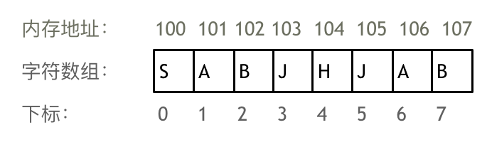
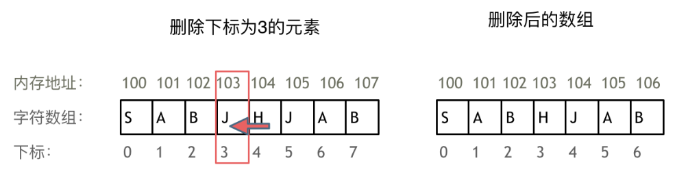
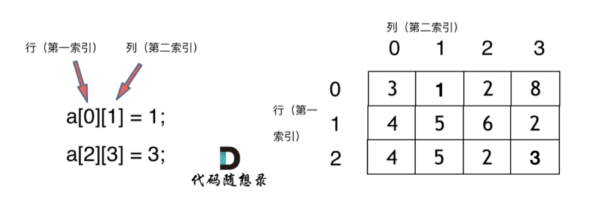

数组是存放在**连续内存空间**上的**相同类型数据**的**集合**  
# 一维数组  
举一个字符数组的例子
  
从这个例子中，我们可以看出来
* 数组下标都是从0开始的
* 数组内存空间的地址是连续的  

正是因为数组在内存空间的地址是连续的，所以我们在删除或者增添元素的时候，就难免要移动其他元素的地址，例如下标为3的元素，需要对下边为3的元素后面所有的元素都做移动操作，如下图
  
如果大家使用C++的话，需要注意vector和array的区别，vector的底层实现是array,严格来讲vector是容器，不是数组（这里不太明白，留空等后面来补）  
要注意：**数组的元素是不能删的，只能覆盖**
# 二维数组  
  

不同编程语言的内存管理是不一样的，以C++为例，C++中二维数组是连续分布的。  
C++的测试代码如下
```cpp
#include <iostream>
using namespace std;

void test_arr(){
    int array[2][3] = {
        {0, 1, 2},
        {3, 4, 5}
    };
    cout << &array[0][0] << " " << &array[0][1] << " " << &array[0][2] << endl;
    cout << &array[1][0] << " " << &array[1][1] << " " << &array[1][2] << endl;
}

int main() {
    test_arr();
}
```
测试地址为
```bash
0x7fffdeeeff20 0x7fffdeeeff24 0x7fffdeeeff28
0x7fffdeeeff2c 0x7fffdeeeff30 0x7fffdeeeff34
```
地址是16进制的，可以看出二维数组地址是连续一条线的，